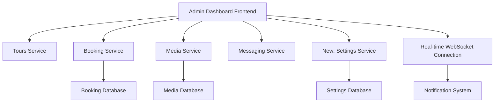

# Admin Dashboard Enhancements - Design Document

## Overview

This design document outlines the architecture and implementation approach for enhancing the existing admin dashboard with homepage hero image management and comprehensive booking oversight capabilities. The solution builds upon the existing microservices architecture and extends the current admin interface with new features for content management and business intelligence.

## Architecture

### System Components

The enhanced admin dashboard will integrate with existing services and introduce new components:



### Service Architecture

1. **Frontend Enhancement**: Extended AdminPage component with new tabs and features
2. **Settings Service**: New microservice for managing homepage settings
3. **Enhanced Booking Service**: Extended with admin endpoints and real-time capabilities
4. **WebSocket Integration**: Real-time notifications for new bookings
5. **Media Service Integration**: Hero image management through existing media service

## Components and Interfaces

### 1. Frontend Components

#### Enhanced AdminPage Component
```typescript
interface AdminPageState {
  activeTab: 'tours' | 'gallery' | 'bookings' | 'homepage' | 'analytics'
  bookings: BookingWithDetails[]
  bookingStats: BookingStats
  heroImage: HeroImageSettings
  notifications: NotificationItem[]
  unreadCount: number
}
```

#### New Components to Create:

**BookingsDashboard Component**
```typescript
interface BookingsDashboardProps {
  bookings: BookingWithDetails[]
  stats: BookingStats
  onStatusUpdate: (bookingId: string, status: BookingStatus) => void
  onAddNote: (bookingId: string, note: string) => void
}
```

**HomepageSettings Component**
```typescript
interface HomepageSettingsProps {
  currentHeroImage: string
  onImageUpdate: (imageUrl: string) => void
  onImageUpload: (file: File) => Promise<void>
}
```

**BookingNotifications Component**
```typescript
interface BookingNotificationsProps {
  notifications: NotificationItem[]
  unreadCount: number
  onMarkAsRead: (notificationId: string) => void
  onClearAll: () => void
}
```

### 2. Backend Services

#### Settings Service (New)
```python
# Endpoints for homepage settings management
GET /settings/homepage          # Get current homepage settings
PUT /settings/homepage/hero     # Update hero image
GET /settings/homepage/hero     # Get current hero image
```

#### Enhanced Booking Service
```python
# New admin endpoints
GET /admin/bookings                    # Get all bookings with pagination
GET /admin/bookings/stats             # Get booking statistics
PUT /admin/bookings/{id}/status       # Update booking status
POST /admin/bookings/{id}/notes       # Add note to booking
GET /admin/bookings/export            # Export bookings as CSV
GET /admin/bookings/recent            # Get recent bookings for notifications
```

#### WebSocket Service Integration
```python
# Real-time notification endpoints
WebSocket /ws/admin/notifications     # WebSocket connection for real-time updates
POST /notifications/booking          # Trigger booking notification
```

## Data Models

### 1. Homepage Settings Model
```python
class HomepageSettings(Base):
    __tablename__ = "homepage_settings"
    
    id = Column(UUID, primary_key=True, default=uuid.uuid4)
    hero_image_url = Column(String(500), nullable=False)
    hero_title = Column(String(200), nullable=True)
    hero_subtitle = Column(String(500), nullable=True)
    updated_at = Column(DateTime, default=func.now(), onupdate=func.now())
    updated_by = Column(String(100), nullable=True)  # Admin user identifier
```

### 2. Enhanced Booking Model
```python
class Booking(Base):
    # Existing fields...
    
    # New fields for admin management
    status = Column(String(20), default="new")  # new, contacted, confirmed, cancelled
    admin_notes = Column(Text, nullable=True)
    contacted_at = Column(DateTime, nullable=True)
    confirmed_at = Column(DateTime, nullable=True)
    assigned_to = Column(String(100), nullable=True)  # Admin user
    priority = Column(String(10), default="normal")  # low, normal, high
    
    # Relationship for booking notes
    notes = relationship("BookingNote", back_populates="booking")
```

### 3. Booking Notes Model
```python
class BookingNote(Base):
    __tablename__ = "booking_notes"
    
    id = Column(UUID, primary_key=True, default=uuid.uuid4)
    booking_id = Column(UUID, ForeignKey("bookings.id"), nullable=False)
    note_text = Column(Text, nullable=False)
    created_by = Column(String(100), nullable=False)  # Admin user
    created_at = Column(DateTime, default=func.now())
    is_internal = Column(Boolean, default=True)  # Internal admin note vs customer-visible
    
    booking = relationship("Booking", back_populates="notes")
```

### 4. Notification Model
```python
class AdminNotification(Base):
    __tablename__ = "admin_notifications"
    
    id = Column(UUID, primary_key=True, default=uuid.uuid4)
    type = Column(String(50), nullable=False)  # booking_new, booking_updated, etc.
    title = Column(String(200), nullable=False)
    message = Column(Text, nullable=False)
    related_id = Column(UUID, nullable=True)  # Related booking/tour ID
    is_read = Column(Boolean, default=False)
    created_at = Column(DateTime, default=func.now())
    expires_at = Column(DateTime, nullable=True)
```

## Error Handling

### Frontend Error Handling
```typescript
// Centralized error handling for admin operations
class AdminErrorHandler {
  static handleBookingError(error: any): void
  static handleImageUploadError(error: any): void
  static handleNotificationError(error: any): void
  static showErrorToast(message: string): void
}
```

### Backend Error Handling
```python
# Custom exception classes for admin operations
class BookingNotFoundError(HTTPException):
    def __init__(self):
        super().__init__(status_code=404, detail="Booking not found")

class ImageUploadError(HTTPException):
    def __init__(self, message: str):
        super().__init__(status_code=400, detail=f"Image upload failed: {message}")

class SettingsUpdateError(HTTPException):
    def __init__(self, message: str):
        super().__init__(status_code=500, detail=f"Settings update failed: {message}")
```

## Testing Strategy

### 1. Unit Tests
- **Frontend Components**: Test each new component in isolation
- **API Endpoints**: Test all new booking and settings endpoints
- **Data Models**: Test model validation and relationships
- **Business Logic**: Test booking status transitions and notifications

### 2. Integration Tests
- **WebSocket Connections**: Test real-time notification delivery
- **Image Upload Flow**: Test complete hero image update process
- **Booking Management**: Test end-to-end booking status updates
- **Cross-Service Communication**: Test service interactions

### 3. End-to-End Tests
- **Admin Workflow**: Test complete admin booking management workflow
- **Homepage Updates**: Test hero image changes reflect on homepage
- **Notification System**: Test notification delivery and management
- **Data Export**: Test booking export functionality

### 4. Performance Tests
- **Dashboard Loading**: Test dashboard performance with large datasets
- **Real-time Updates**: Test WebSocket performance under load
- **Image Upload**: Test large image upload handling
- **Database Queries**: Test query performance for booking analytics

## Implementation Phases

### Phase 1: Backend Foundation
1. Create Settings Service with homepage management
2. Extend Booking Service with admin endpoints
3. Implement enhanced booking data models
4. Set up WebSocket infrastructure for notifications

### Phase 2: Frontend Core Features
1. Create BookingsDashboard component
2. Implement HomepageSettings component
3. Add new admin tabs to existing AdminPage
4. Integrate with enhanced booking APIs

### Phase 3: Real-time Features
1. Implement WebSocket client for notifications
2. Create notification management system
3. Add real-time booking updates
4. Implement notification badges and alerts

### Phase 4: Analytics and Insights
1. Create booking analytics endpoints
2. Implement dashboard charts and metrics
3. Add booking trend analysis
4. Create export functionality

### Phase 5: Polish and Optimization
1. Add comprehensive error handling
2. Implement loading states and optimistic updates
3. Add data validation and sanitization
4. Performance optimization and caching

## Security Considerations

### Authentication and Authorization
- Admin-only endpoints protected with authentication middleware
- Role-based access control for different admin functions
- Secure file upload validation for hero images
- Input sanitization for all admin inputs

### Data Protection
- Sensitive customer data handling in compliance with privacy regulations
- Secure storage of admin notes and internal communications
- Audit logging for all admin actions
- Rate limiting on admin endpoints

### File Upload Security
- Strict file type validation for hero images
- File size limits and virus scanning
- Secure file storage with proper permissions
- Image optimization and compression

## Monitoring and Logging

### Application Monitoring
- Dashboard performance metrics
- API response times for admin endpoints
- WebSocket connection health
- File upload success/failure rates

### Business Metrics
- Booking conversion rates
- Admin response times to new bookings
- Popular tour booking trends
- Customer satisfaction indicators

### Error Tracking
- Failed booking status updates
- Image upload failures
- WebSocket connection issues
- Database query performance issues